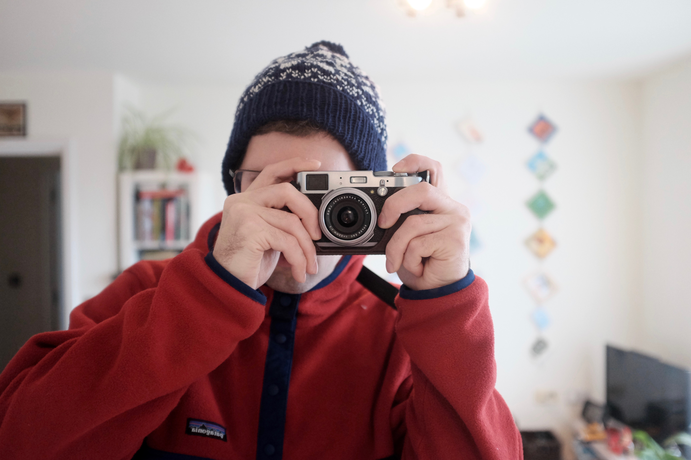

<figure class="figure">
  
</figure>

I'm an interaction designer living and working in London. I'm into cities, bikes, climbing, philosophy and post-it notes.

In my spare time I read comics, try to guess what font everything is in, and go to museums a lot. I also like to go climbing at weekends which takes me to some pretty remote but beautiful parts of the UK.

I've always loved technology and design in equal measure. At school, frustrated by the inelegance and sheer ugliness of early Microsoft Windows, I switched to desktop [Linux][linux]. While I wasted many hours compiling software and broke more things than I could fix, it was an amazing experience that gave me a solid understanding of software and computing in general.

I started my career in a design agency specialising in third sector clients (charities and not-for-profits). Since then I have contracted, freelanced and worked directly with clients to create simple, elegant and performant sites.

I post photos on [Instagram][instagram], go through phases of [tweeting][twitter], and can be found on [Facebook][facebook]. My lifelong mission is to make fleeces cool again.

[linkedin]: https://www.linkedin.com/in/sctomlinson
[linux]: https://en.wikipedia.org/wiki/Linux
[instagram]: http://instagram.com/ffub
[twitter]: http://twitter.com/ffub
[facebook]: https://www.facebook.com/profile.php?id=100009629237906