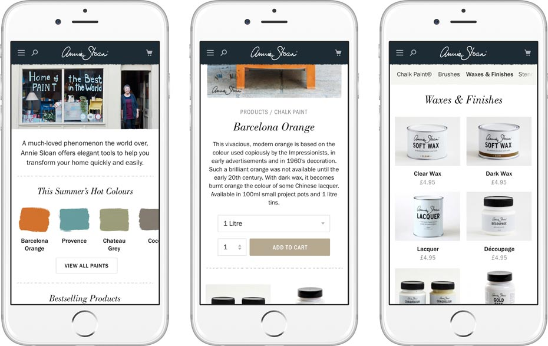
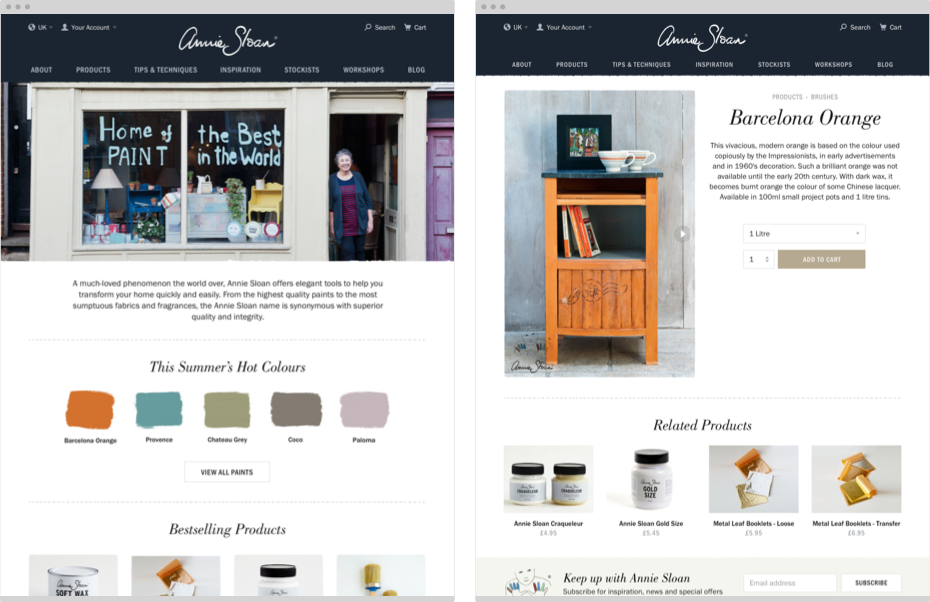
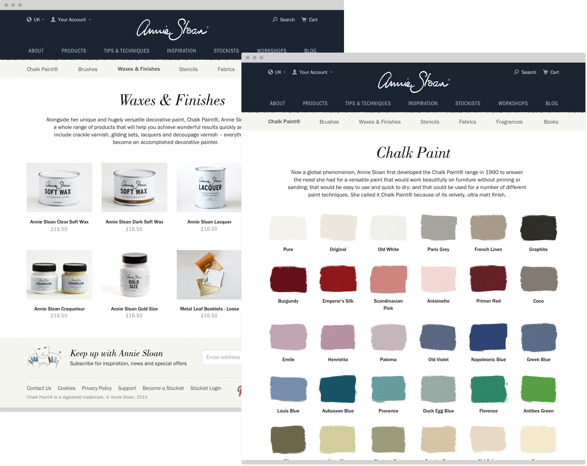

Annie Sloan is an interior designer and the inventor of the hugely successful Chalk Paint. She has grown her business from a small shop in Oxford to a global brand with over twelve hundred stockists. I designed a new site to act as an effective online store and an essential reference for her fans worldwide.

## Responsive by design

Mobile screen sizes see the largest number of sessions on Annisloan.com, followed by desktop and tablet. I designed the site from mobile up to work across all devices.

<figure class="figure figure--wide">
  
  <figcaption>The home, product and category pages</figcation>
</figure>

## A visual storefront

Annie Sloan products are all about out using your own creativity. I contrasted crisp, colourful photography with hand drawn elements and rough edges to create a site that feels both upmarket and playful.

<figure class="figure figure--wide">
  
	<figcaption>The home and product pages both make strong use of beautiful bespoke photography</figcaption>
</figure>

Each and every colour of Chalk Paint is unique. We gave each colour it's own product page and a category page that matched up to the colour card customers find in store.

<figure class="figure figure--wide">
  
</figure>
