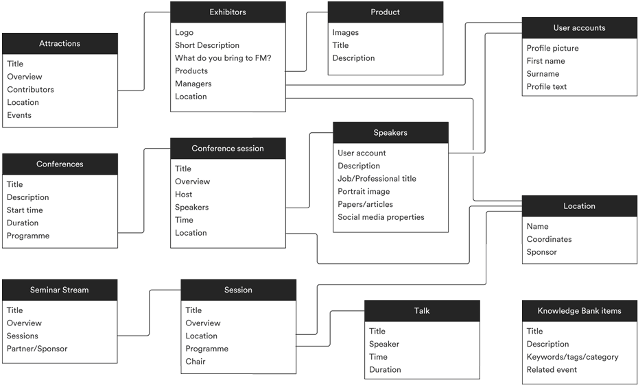
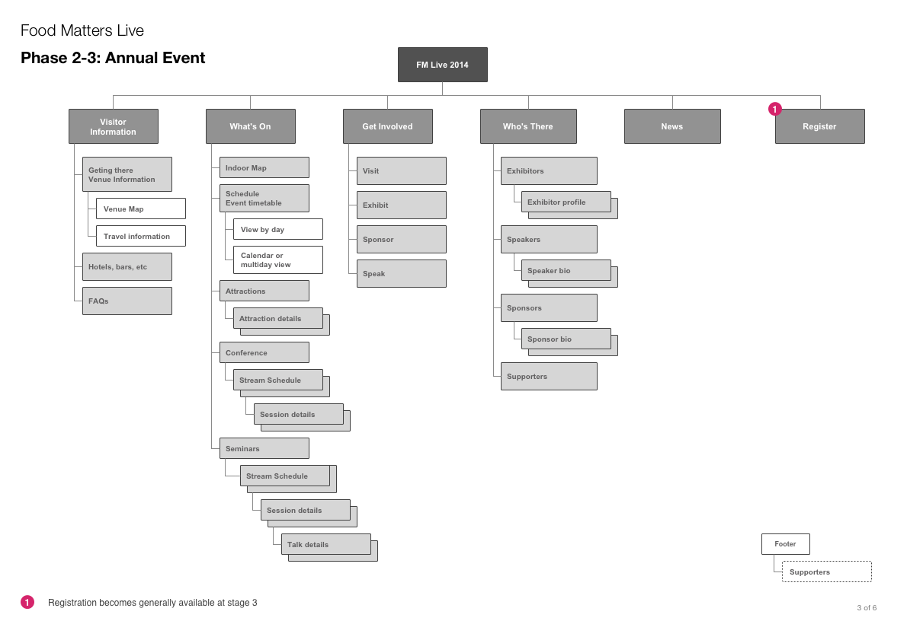
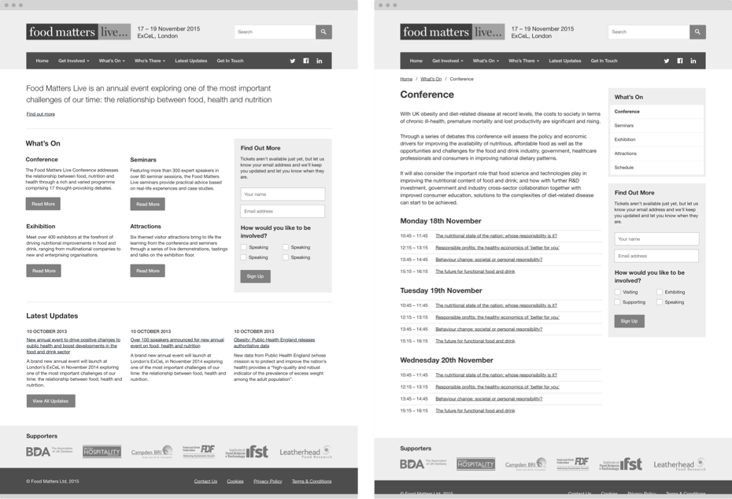

Food Matters Live is a major annual event focussed on the relationship between food, health and nutrition. Agency [Pollitt & Partners][pollitt] asked me to devise the information architecture for their website.

## Modelling the event

I ran a number of workshops to understand the how the event was going to be organised and just what information the site needed to convey. With exhibitors, speakers, products and a busy schedule of talks, seminars and conferences, the event was very complex.

<figure class="figure figure--wide">
    
    <figcaption>I created a content model to visualise all the content the site needed to cover</figcaption>
</figure>

## Sitemaps

We split the site's roll out in phases based on the build up to the first event, during the event and then gearing the site up for multiple events and archiving of previous events. I created a set of sitemaps that charted the course of the IA through these phases.

<figure class="figure figure--wide">
  
</figure>

## Wireframes

After we had settled on a sitemap and worked up our first user journeys I set about working on a blueprint for the site. I initially sketched out how we might put the information architecture in practice within the site's navigation and from these sketches produced some wireframes we could present to the client and development partner.

<figure class="figure figure--wide">
  
</figure>

## HTML Prototype

After a few iterations of wireframes and feedback, I moved to HTML and CSS to create a clickable prototype. I used the [Bootstrap][bootstrap] CSS framework and a static site generator, [Middleman][middleman], to aid in rapid development.

I stored the project in a Git repository and created branches for different experimental layouts, navigation models and phases. This allowed us to iterate on a working and understandable website all the way through and the client was thrilled to be able to see a real working site come together in such rapid time.

## Design

The designs for the site were created by Rodrigo Lozano, Senior Designer at Pollitt & Partners.

<figure class="figure figure--wide">
  
</figure>

## Results

The Food Matters Live event has been a huge success and is in it's second year. Despite a change in the visual design of the site since 2014, the information architecture I created has remained in place.

[food matters]: http://www.foodmatterslive.com/
[pollitt]: http://www.bostockandpollitt.com/
[bootstrap]: http://getbootstrap.com
[middleman]: https://middlemanapp.com