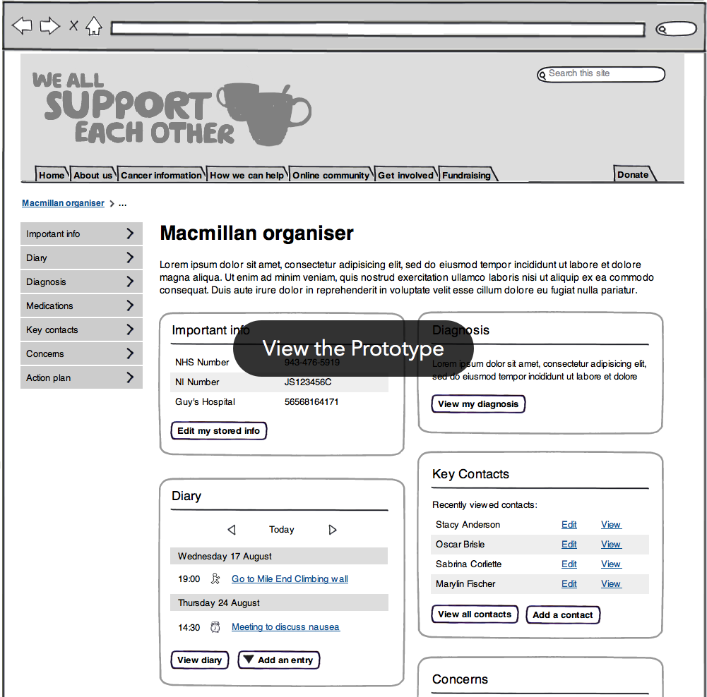

I prototyped the Macmillan Organiser to help people with cancer keep track of and store all the important information pertaining to their treatment. Bostock and Pollitt had created a [paper version][paper]. I created a series of wireframes and then made them into a [working prototype][prototype].

<figure class="figure">
  
</figure>

[paper]: http://www.bostockandpollitt.com/work/macmillan-organiser/
[prototype]: prototype/Dashboard.html