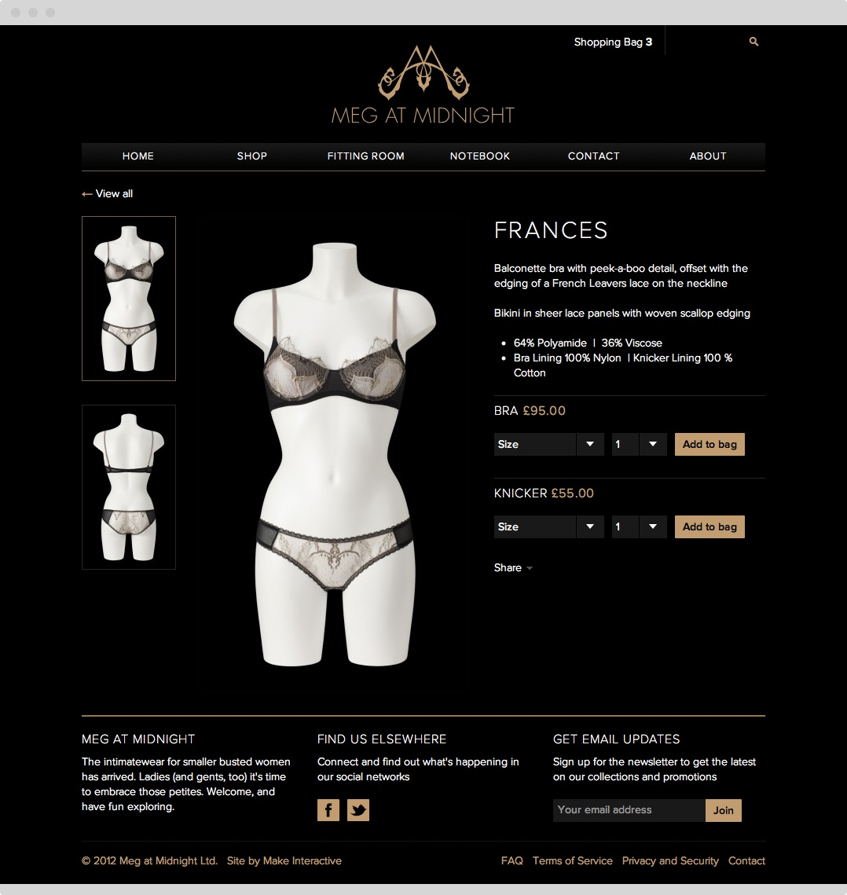
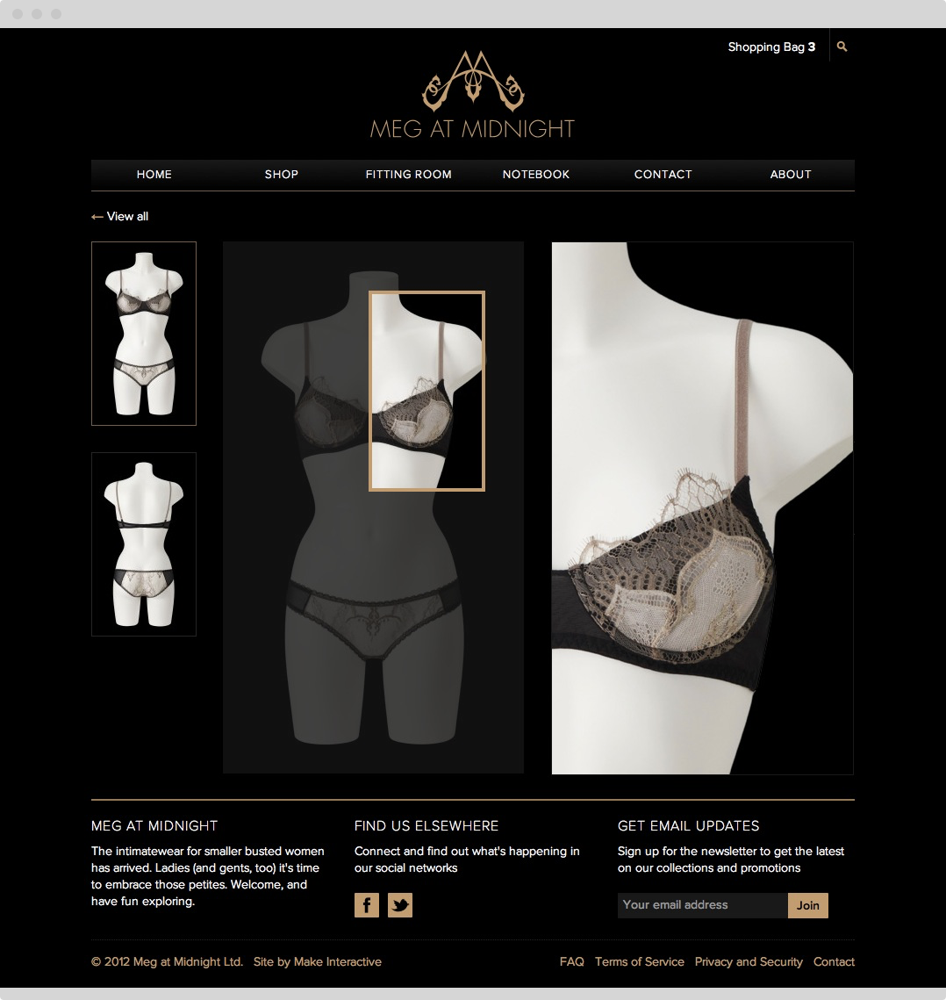

Meg at Midnight is a young luxury underwear brand. I helped Megan, the founder, to get the brand online with a site that showcases the range and provides a shop front to buy the garments.

## Multilevel products

Key to the product was the arrangement of products within the catalogue. Meg at Midnight's range features up to three garments for each product group. The description and images are attached to the range, whilst the sizes and inventory are attached to the products.
 
<figure class="figure">
  
  <figcaption>The product page</figcaption>
</figure>

<figure class="figure">
  
  <figcaption>Mousing over the image shows a zoomed in view to show detail</figcaption>
</figure>

## One-step checkout

We wanted the checkout process to be as simple as possible. Stripe had yet to launch in the UK and so we used PayPal’s Web Payments Standard product which gave us the best reach for a payments platform, while still avoiding the difficulties of setting up merchant accounts and dealing with PCI compliance.

[ProcessWire](http://www.processwire.com/) is a new content management system on the scene and brilliant to work with. The ecommerce functionality was quite limited and I created a new module to provide PayPal integration and integrated checkout.

<figure class="figure">
  
  <figcaption>Mousing over the image shows a zoomed in view to show detail</figcaption>
</figure>