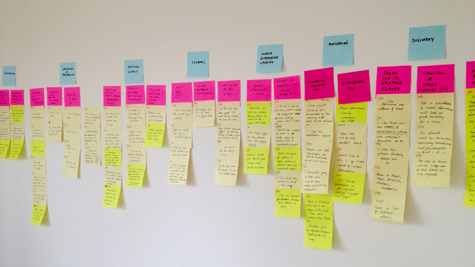
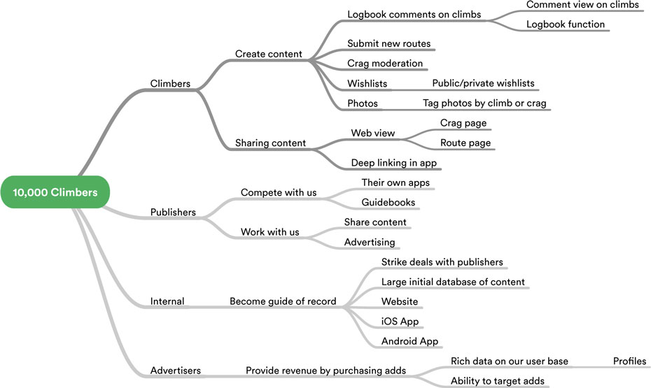
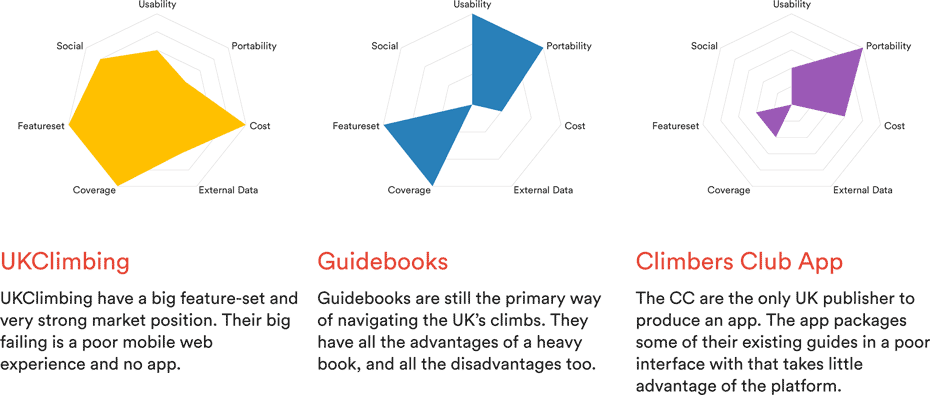
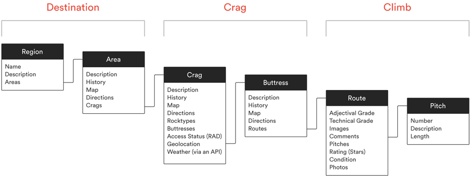
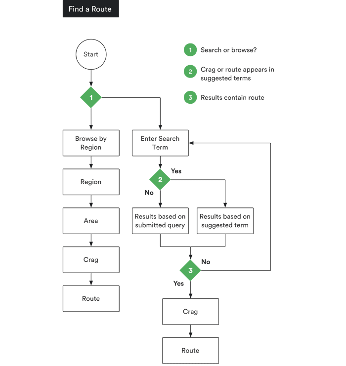
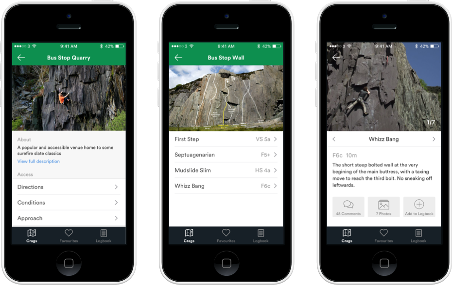

Mountain Leader is a climbing guidebook app I designed for a part-time course UX at [General Assembly][ga]. The app sets out to create the perfect companion to rock climbing in the United Kingdom.

## The Problem

Currently, guide books are the standard way of discovering and navigating Britain's varied outdoor rock climbing. These are heavy, expensive (around £20 each) and need to be bought in advance of arriving at a climbing destination. My project started with the assumption that climbing guides will move to digital, be available on-demand and fit in your pocket.

Not only can a digital guide overcome some of the shortcomings of books, but it has the potential to be a more integrated, social climbing guide that's always up to date and draws on external data such as weather forecasts.

## Research

My goal was to discover how climbers use current guidebooks and apps in their climbing and what opportunities there are to improve upon their experience. I interviewed nine climbers at [Mile End Climbing Wall][mile end] and at my [climbing club][nlmc]’s cottage in North Wales.

My areas of enquiry were as follows:

* What does a day's climbing look like?
* What do climbers like/dislike about climbing?
* What do guidebooks do well, and what do they do poorly?
* How do climbers measure their progression and set goals?
* How do climbers use existing apps and websites?

<figure class="figure figure--wide">
  
  <figcaption>I used affinity mapping to find themes among my observations</figcaption>
</figure>

## Findings

I split the results of my research into individual observations and insights from which I could identify common themes. My broad findings were:

* Climbers want to know as much as they can about a climb beforehand. They will use a variety of information sources to research a climb, especially if it is near the limit of their climbing abilities.

* Online comments and logbook entries are really useful to get a perspective on whether a climb is safe, in condition, or under or over-graded.

* Progression is a key part of the experience of climbing. This has many positives – climbers talked of pushing themselves, training for specific routes, friendly competition and having a sense of achievement from the sport.

* Many climbers expressed performance anxiety and the sense that other climbers are too focussed on grades and competition.

* Climbing is adventurous. Most climbers spoke of the travel it involved as being a big motivating factor. Many felt that it required meditative levels of concentration, which allowed them to escape the humdrum of life. The overall experience of climbing is important and not just the grades.

* Climbing in the UK is dictated largely by the weather and final destinations for trips will often change at the last minute to follow a good forecast.

## Personas

To condense the goals and motivations of the climbers I spoke to I identified three key personas.

<figure class="figure figure--wide">
  
  <!-- <figcaption>An experience map of a typical climbing trip</figcaption> -->
</figure>

London is one of the worst places in the UK to be a climber – the climb-able rock is at least three hours drive away. It was clear that my personas represented London-based climbers well, but further research would be required to capture the behaviour and motivations of climbers across the UK.

## A typical climbing trip

From the interviews and my own climbing experiences, I had a clear picture of a typical climbing trip and I found it really helpful to visualise this experience and record the sort of tools and experiences one might have across the day.

<figure class="figure figure--wide">
  
  <figcaption>The experience of a typical climbing trip</figcaption>
</figure>

## Business Analysis

I set an end goal of 10,000 active climbers using the app and worked back from there using [impact mapping][impact-mapping].

<figure class="figure figure--wide">
  
  <figcaption>Impact map</figcaption>
</figure>

The key insights from the impact mapping were that:

* An advertising model means capturing market share
* Those best placed to launch such a product are existing publishers such as the Rockfax, the Climbers Club or Send Up
* To appeal to advertisers, the product needs to gather rich data on its users
* Ultimately the product will need web views of the key screens to allow sharing and linking

## Competitors

My impact map identified where competitors could both help and hinder the apps chances. I analysed the key competitors by measuring them against key criteria.

<figure class="figure figure--wide">
  
</figure>

## Information Architecture

Mountain Leader's goal it to make the UK's climbing navigable, so it was crucial for the information architecture to match climbers' current mental model of climbs.

Rather than identify my own map of the UK's climbing regions, I contacted the British Mountaineering Council, who were happy to share the regions and crags they use for their Regional Access Database.

<figure class="figure figure--wide">
  
</figure>

Adding to this I mapped out an architecture with the features I wanted to include in the app. I tested this with [Treejack][treejack], an excellent tool for trying out site maps. I tested **three tasks** with **ten participants**:

* Find a specific crag
* Bookmark a different crag and find it again
* Find a crag you have been to recently

Participants were broadly able to complete the tasks with a success rate of 80% and directness of 90%. Favourites proved to be hard for participants to understand with a few navigating to it before navigating elsewhere. After renaming a few paths and re-running the tasks I achieved a 90% success rate and 100% direcntess, a result I was happy with.

<!-- <figure class="figure figure--wide">
  
  <figcaption>The final information archictecture of the app
</figure> -->

## Prototype

For my prototype I wanted to concentrate on a few key tasks to validate my overall assumptions. I diagrammed each task flow, before designing the relevant screens.

<figure class="figure">
	
  <figcaption>Finding a route</figcaption>
</figure>

Moving from Sketch to Marvel I put together a medium-fidelity app that could be tested on a phone. I then recruited and tested the app with eight participants. Marvel has recently added support for recording both a prototype's screen area and the participant's face – I used this functionality to record each session.

My **first test** set out to identify if the information architecture and interface for finding crag or route was easy to use. My hypothesis was that users would primarily use search to find a crag, with some instead opting to browse by region.

The findings surprised me – no one found the search! I had used an icon on the top right, a familiar iOS convention, but all participants had immediately engaged with the menus further down the screen.

<figure class="figure figure--wide">
  
  <figcaption>Navigating the crag, buttress and route screens</figcaption>
</figure>

Furthermore the hierarchy of Crag → Buttress → Route was confusing for users, who found 'buttress' ambiguous.

I improved the visibility of search and changed buttresses from a menu level of hierarchy to merely dividing climbs and re-tested with a further five climbers. Two of the five now went straight to search and were able to easily find both crags and routes.

I continued this iterative testing approach for a further three tests focussing on wish-lists and bookmarking a favourite crag.

## Results

My project won joint best in class, for which I won a lovely sketchbook! This was my first attempt at designing and prototyping a mobile app – an experience I found both challenging and rewarding.

<blockquote class="blockquote--testimonial">
  
"Stephen's project was one of the best in the class, he grasped all of the techniques really well, and was able to put them into practice brilliantly. I have no doubt Stephen will make a fantastic UX designer, and a great addition to any user experience team!"

  <cite class="blockquote__author">
    Kayleigh Fugatt
    
Course Tutor

  </cite>
</blockquote>

Various techniques such as impact mapping and radial diagrams for showing the results of competitor analysis were new to me, and I've gained a much deeper understanding of some processes I thought I was familiar with.

## Further work

In order to take this project further I would want to expand my user research to more of the UK and develop personas for the regular climbers living near Britain's best rock climbing.

I would also like to further iterate on the core experience of using climbing topos for route finding within the app.

A further fun project would a companion watch app for route-finding on longer multi-pitch routes.

[mile end]: https://www.mileendwall.org.uk
[ukc]: http://www.ukclimbing.net
[ga]: https://www.generalassemb.ly
[nlmc]: http://www.nlmc.co.uk "North London Mountaineering Club"
[impact-mapping]: http://www.impactmapping.org
[treejack]: https://www.optimalworkshop.com/treejack
