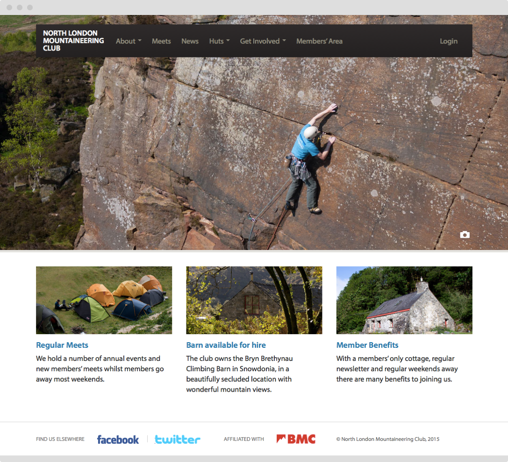
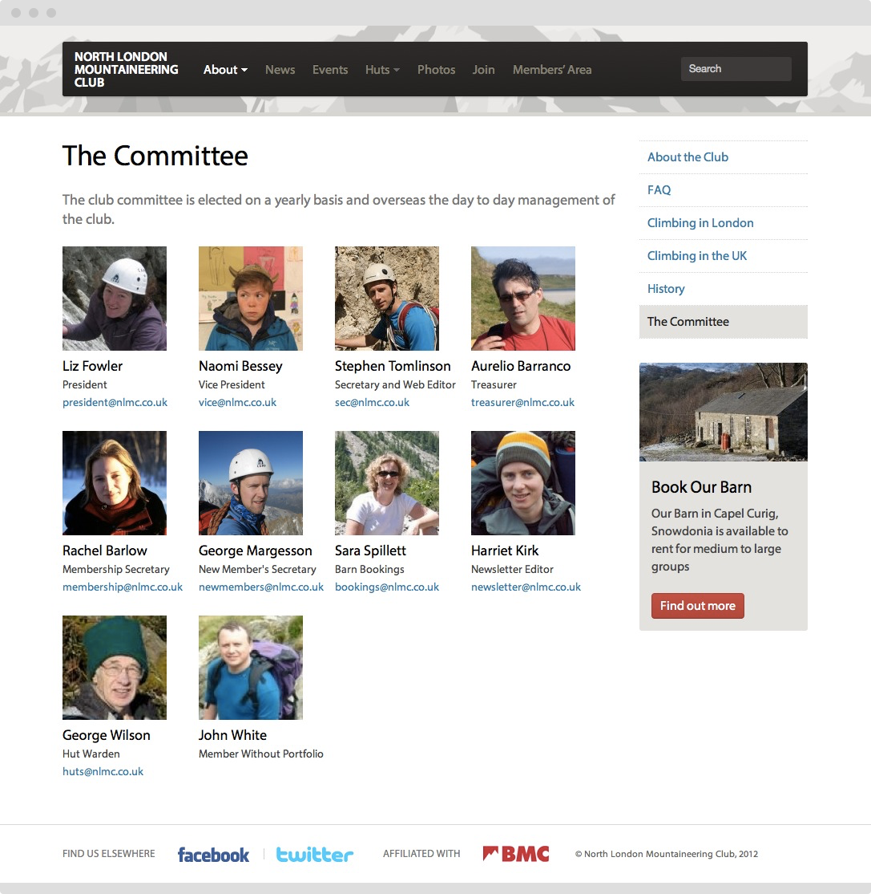
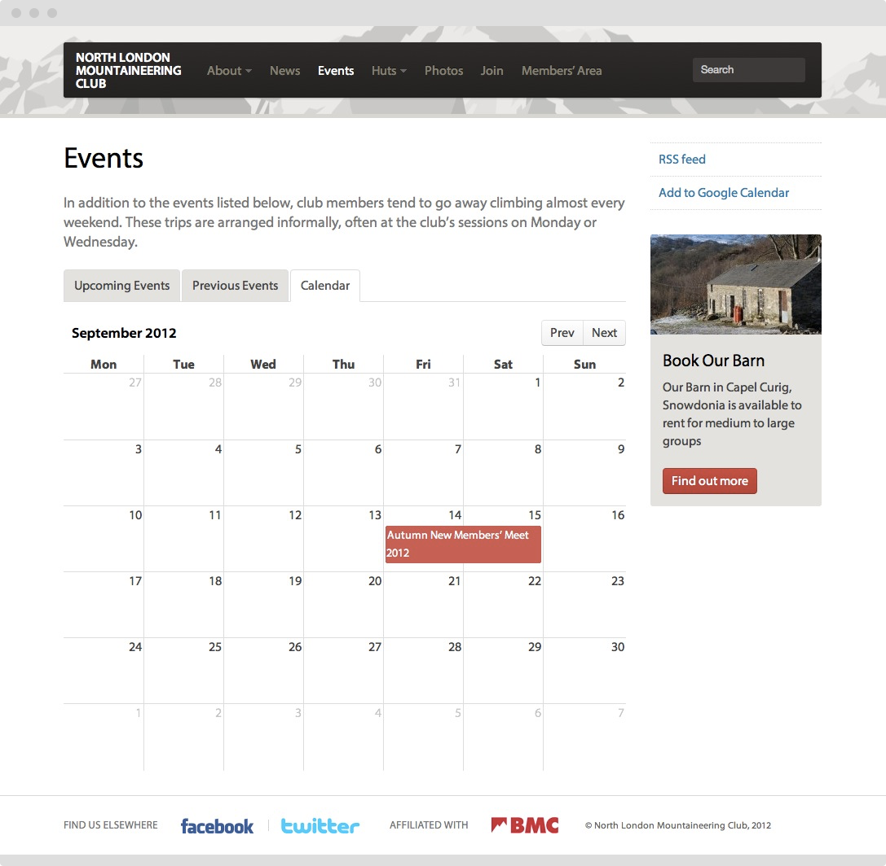
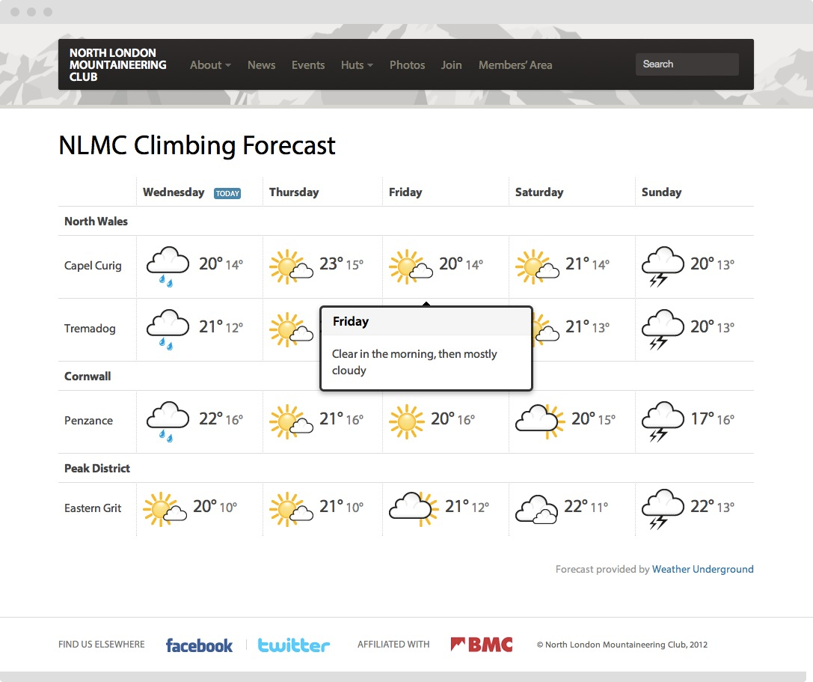

In my spare time, I enjoy climbing and mountaineering. My mountaineering club asked me if I could redesign their website. After I completed the initial revamp, I've subsequently added a members' area, newsletter archive and articles from members. I continue to adapt the site to the needs of members based on annual surveys and informal feedback.

<figure class="figure">
  
</figure>

<figure class="figure">
  
</figure>

## A clearer meets calendar

Climbing meets are the most important ways of attracting and getting to know new members. From my experience working with another events-based client, I knew that a good pattern is to provide both a quickly scannable list of what is upcoming as well as a more traditional calendar. The list lets visitors see what is heppening next, whereas the calendar allows lets them view the meets spatially across the year or against their own calendar.

<figure class="figure">
  
</figure>

## Fair-weather climbers

The most requested feature of the new site is a weather page to show where to head at the weekend. In terms of location, London is one of the worst parts of the UK for climbing, which necessitates many hours spend driving to the Peak District or Wales at the weekends, so it's important to pick the right destination.

We built a weather page that charts the weather at the locations and crags we visit most regularly, giving a broad synopsis of the conditions there.

<figure class="figure">
  
</figure>

